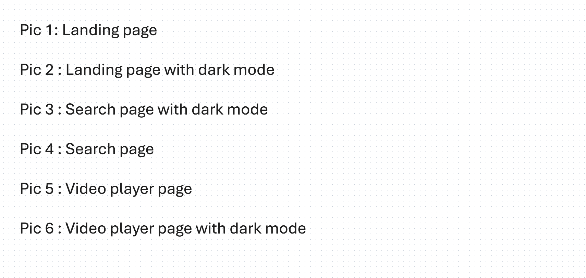
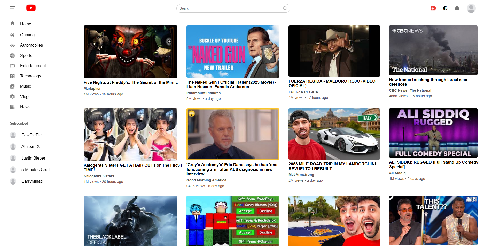
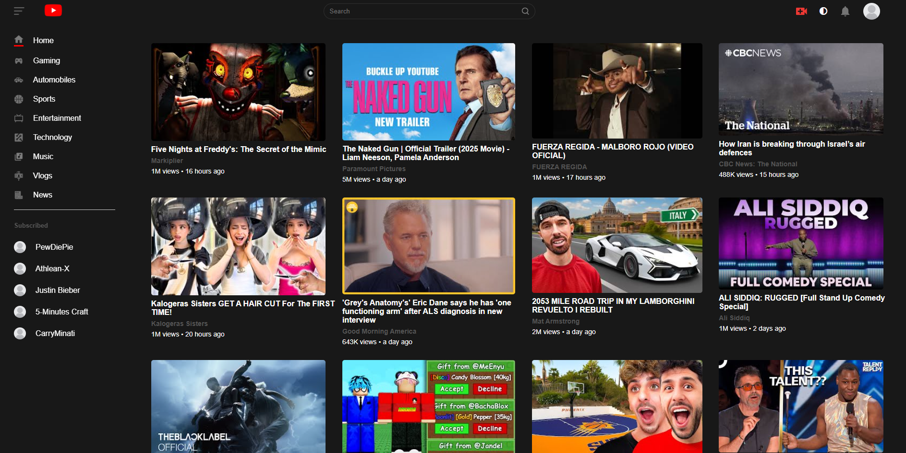
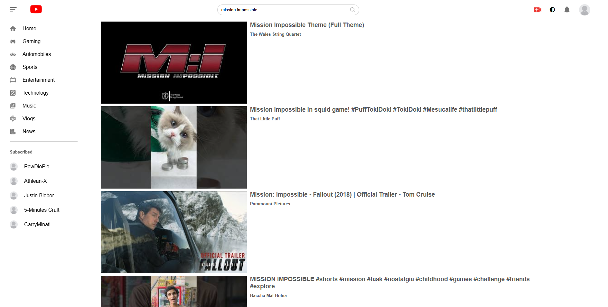
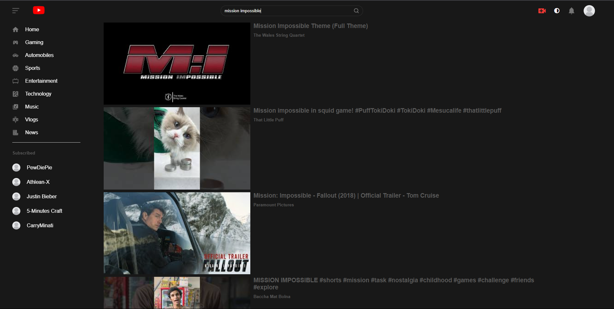
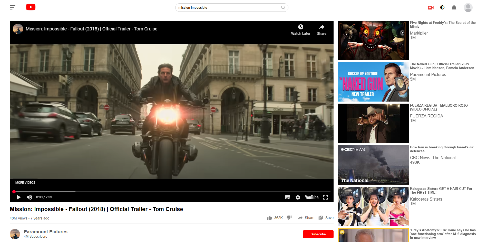
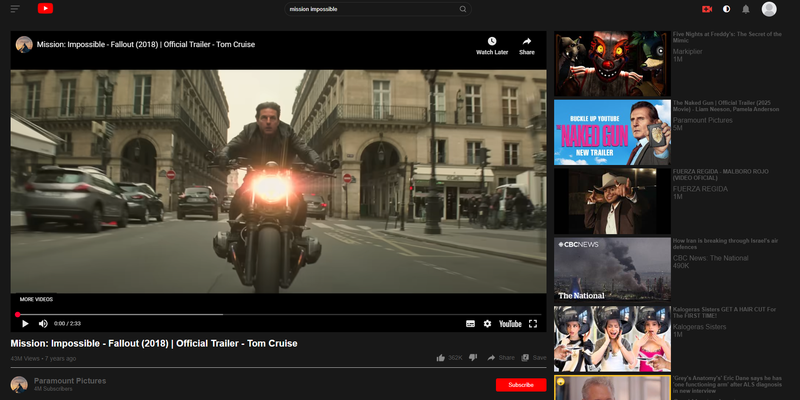

 YouTube Clone

# YouTube Clone 

A frontend clone of YouTube, with search functionality and video display. Built using React and modern UI design principles.

## ⭐ Live Demo
[Click Here to View](https://youtube-clone-eta-liard.vercel.app/)

## Tech Stack
- React
- JavaScript
- CSS
- YouTube API

## Features
- Responsive design
- Search bar with mock functionality
- Video thumbnails and display
- Modern layout inspired by YouTube

## 📸 Screenshots








## Installation & Running Locally

```bash
git clone https://github.com/Iffti2000/youtube-clone.git
cd youtube-clone
npm install
npm start
