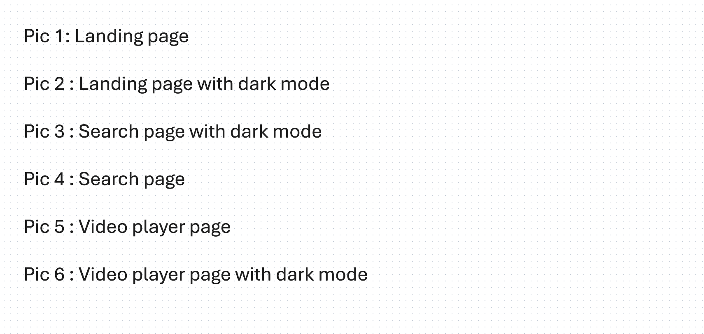
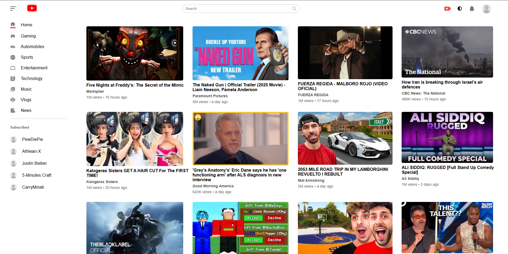
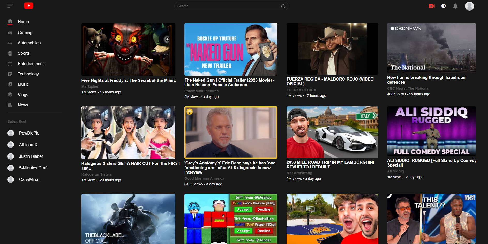
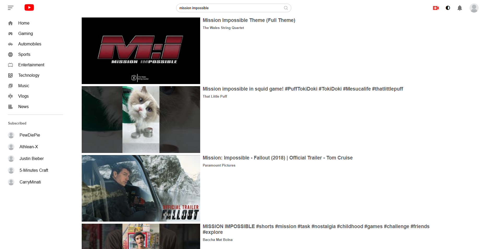
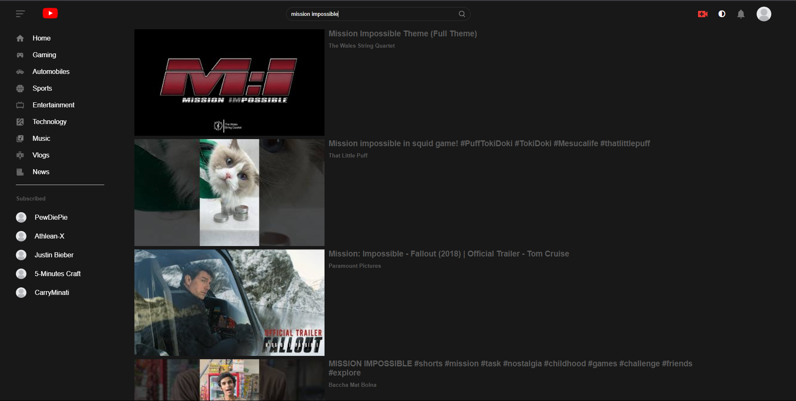
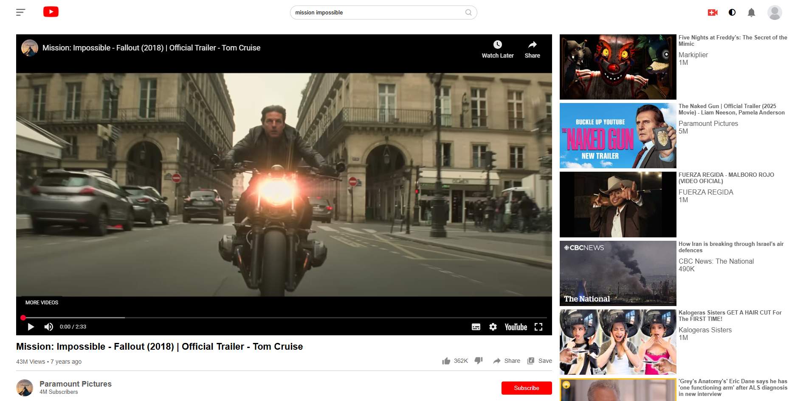
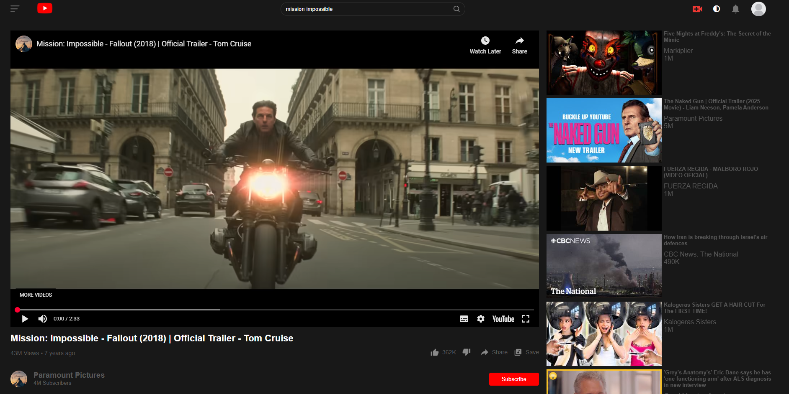

# YouTube Clone 

A frontend clone of YouTube, with search functionality and video display. Built using React and modern UI design principles.

## Live Demo
[Click Here to View](https://youtube-clone-eta-liard.vercel.app/)

## Tech Stack
- React
- JavaScript
- Youtube Data API

## Features
- Responsive design
- Search bar with mock functionality
- Video thumbnails and display
- Modern layout inspired by YouTube

## Screenshots

### Intro


### Landing Page


### Landing Page in dark mode


### Search Results Page


### Search Results Page in dark mode


### Video Player Page


### Video Player Page in dark mode


## Installation & Running Locally

```bash
git clone https://github.com/Iffti2000/youtube-clone.git
cd youtube-clone
npm install
npm start
